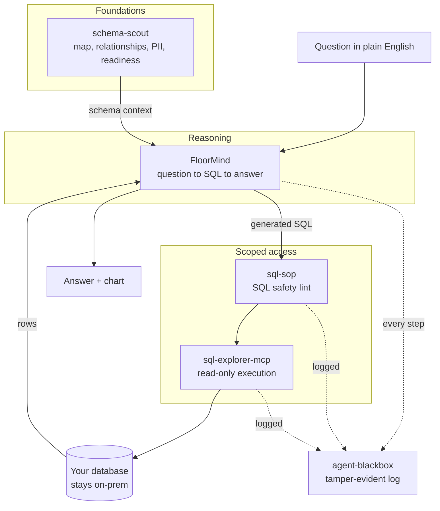

# Governed Agent Stack

**Free, on-prem building blocks for an AI agent you can point at a real database and actually audit.**

Every 2026 agentic-AI report lands on the same two blockers, and neither of them is the model. The first is the data underneath it: nobody mapped the database, so the agent is working blind. The second is governance around it: nothing constrains what the agent can touch, and there is no trustworthy record of what it did. Pilots stall there, not on model quality.

This is a reference stack of small tools that each solve one of those problems, run entirely on your own hardware, and cost nothing. Each one stands on its own. Put together, they make up an agent you can place in front of a regulated database without losing sleep.

Nobody packages this free and on-prem. That is the whole point.

## The four layers

| Layer | Tool | Job |
|---|---|---|
| **Foundations** | [schema-scout](https://github.com/Pawansingh3889/schema-scout) | Map the database, recover undeclared relationships, flag PII, and score how ready the schema actually is for an agent. |
| **Scoped access** | [sql-explorer-mcp](https://github.com/Pawansingh3889/sql-explorer-mcp) + [sql-sop](https://github.com/Pawansingh3889/sql-guard) | Give the agent read-only SQL access, with every query parsed and linted before it runs. |
| **Reasoning** | [FloorMind](https://github.com/Pawansingh3889/FloorMind) | Turn a plain-English question into a checked query and a plain-English answer. |
| **Accountability** | [agent-blackbox](https://github.com/Pawansingh3889/agent-blackbox) | Record every step in a tamper-evident, hash-chained log you can verify later. |

## How it fits together

## How a question flows through it

1. **Once, up front:** point schema-scout at the database. It produces a catalog, an agent-ready context file, and a readiness score. If the score is low, you fix the foundations before going further. Re-run it on a schedule and use `diff` to catch drift.
2. **A user asks a question** in plain English. FloorMind uses the schema context to route the question to the right domain and tables, then drafts SQL.
3. **Before anything touches the database,** sql-sop lints the draft and sql-explorer-mcp enforces read-only execution. Writes never run, and there are three independent checks rather than one.
4. **Results come back** and FloorMind explains them in plain English, with context.
5. **agent-blackbox records the whole chain** (question, SQL, result, outcome) in a hash-chained ledger. Anyone can verify later that the record was not altered after the fact.

## Why on-prem, why free

- **Nothing leaves the building.** The database, the local LLM (Ollama), and the logs all stay on your hardware. That is the whole reason this exists for regulated or privacy-sensitive data.
- **Read-only by enforcement, not by trust.** Three layers have to agree before a query runs, so a misconfigured login is not your only protection.
- **Auditable by design.** The log is tamper-evident, so "what did the agent do" has a real, checkable answer.
- **No licence cost, no per-seat fee, no vendor lock-in.** Clone the pieces you need and run them.

## The pieces

Each tool is its own repo with its own docs. Start with whichever problem is most urgent. Usually that is schema-scout, because everything downstream depends on knowing the data first.

- **[schema-scout](https://github.com/Pawansingh3889/schema-scout)**: maps a SQL Server database, recovers hidden foreign keys, flags PII, scores agent-readiness, and serves the catalog to an agent over MCP.
- **[sql-explorer-mcp](https://github.com/Pawansingh3889/sql-explorer-mcp)**: read-only Model Context Protocol server for SQL Server, Postgres, and SQLite, with three layers of safety.
- **[sql-sop](https://github.com/Pawansingh3889/sql-guard)**: a fast rule-based SQL linter (available on [PyPI](https://pypi.org/project/sql-sop/)) that catches dangerous and slow patterns before a query runs.
- **[FloorMind](https://github.com/Pawansingh3889/FloorMind)**: an on-prem natural-language query tool for manufacturing data, eval-measured rather than vibes-based.
- **[agent-blackbox](https://github.com/Pawansingh3889/agent-blackbox)**: an append-only, hash-chained ledger that gives agent actions a tamper-evident audit trail.

## Status

All five components are public and usable today. This repo is the map that ties them together, not a separate install. Pick the layers you need.

## License

[MIT](LICENSE).
