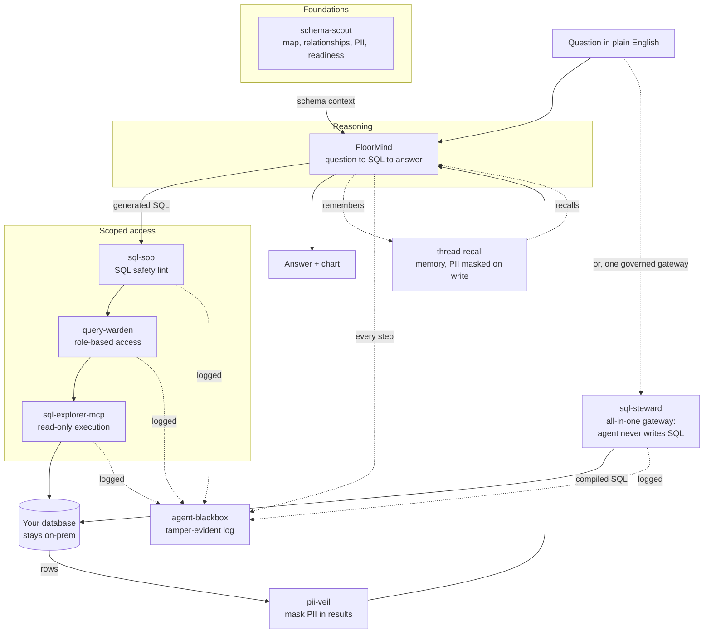

# Governed Agent Stack

**Free, on-prem building blocks for an AI agent you can point at a real database and actually audit.**

Every 2026 agentic-AI report lands on the same two blockers, and neither of them is the model. The first is the data underneath it: nobody mapped the database, so the agent is working blind. The second is governance around it: nothing constrains what the agent can touch, and there is no trustworthy record of what it did. Pilots stall there, not on model quality.

This is a reference stack of small tools that each solve one of those problems, run entirely on your own hardware, and cost nothing. Each one stands on its own. Put together, they make up an agent you can place in front of a regulated database without losing sleep.

Nobody packages this free and on-prem. That is the whole point.

## The layers

| Layer | Tool | Job |
|---|---|---|
| **Foundations** | [schema-scout](https://github.com/Pawansingh3889/schema-scout) + [drift-gate](https://github.com/Pawansingh3889/drift-gate) | Map the database, recover undeclared relationships, flag PII, and score how ready the schema actually is for an agent — then refuse to run once that schema moves without review. |
| **Scoped access** | [sql-explorer-mcp](https://github.com/Pawansingh3889/sql-explorer-mcp) + [sql-sop](https://github.com/Pawansingh3889/sql-guard) + [query-warden](https://github.com/Pawansingh3889/query-warden) | Give the agent read-only SQL access: every query is parsed, linted, and checked against role-based access rules before it runs. |
| **Reasoning** | [FloorMind](https://github.com/Pawansingh3889/FloorMind) | Turn a plain-English question into a checked query and a plain-English answer. |
| **Result masking** | [pii-veil](https://github.com/Pawansingh3889/pii-veil) | Mask any PII that survives into result rows before they reach the model. |
| **Accountability** | [agent-blackbox](https://github.com/Pawansingh3889/agent-blackbox) | Record every step in a tamper-evident, hash-chained log you can verify later. |
| **Memory** | [thread-recall](https://github.com/Pawansingh3889/thread-recall) | Carry context between turns without carrying PII with it — masked on write, so the long-term store never retains what the policy refuses. |

## Flagship: sql-steward

[sql-steward](https://github.com/Pawansingh3889/sql-steward) bundles the scoped-access, masking, and accountability layers into one Model Context Protocol server, behind a stronger guarantee: **the agent never writes SQL at all.** Instead of validating SQL the model wrote, sql-steward compiles every query from a semantic layer you control (entities, joins, metrics, PII tags), so there is no `run_sql` tool to misuse. Blocked PII is refused before the query runs, every call can land in the agent-blackbox ledger, and the same tools work across SQL Server, Postgres, and SQLite.

Use it as the all-in-one entry point, or compose the individual pieces below yourself. They are the same building blocks either way.

## How it fits together


```mermaid
flowchart TB
    Q["Question in plain English"] --> AG

    subgraph Foundations
        SS["schema-scout<br/>map, relationships, PII, readiness"]
    end

    subgraph Reasoning
        AG["FloorMind<br/>question to SQL to answer"]
    end

    subgraph Scoped_access["Scoped access"]
        SOP["sql-sop<br/>SQL safety lint"]
        WARD["query-warden<br/>role-based access"]
        EX["sql-explorer-mcp<br/>read-only execution"]
    end

    DB[("Your database<br/>stays on-prem")]
    VEIL["pii-veil<br/>mask PII in results"]
    A["Answer + chart"]
    BB["agent-blackbox<br/>tamper-evident log"]
    TR["thread-recall<br/>memory, PII masked on write"]
    ST["sql-steward<br/>all-in-one gateway:<br/>agent never writes SQL"]

    SS -- schema context --> AG
    AG -- generated SQL --> SOP --> WARD --> EX --> DB
    DB -- rows --> VEIL --> AG --> A

    AG -. remembers .-> TR
    TR -. recalls .-> AG

    Q -. or, one governed gateway .-> ST
    ST -- compiled SQL --> DB

    AG -. every step .-> BB
    SOP -. logged .-> BB
    WARD -. logged .-> BB
    EX -. logged .-> BB
    ST -. logged .-> BB
```

## How a question flows through it

1. **Once, up front:** point schema-scout at the database. It produces a catalog, an agent-ready context file, and a readiness score. If the score is low, you fix the foundations before going further. Re-run it on a schedule and use `diff` to catch drift.
2. **A user asks a question** in plain English. FloorMind uses the schema context to route the question to the right domain and tables, then drafts SQL.
3. **Before anything touches the database,** sql-sop lints the draft, query-warden checks it against the asker's role (which tables and columns they may see), and sql-explorer-mcp enforces read-only execution. Writes never run, and out-of-role access is blocked before it reaches the database.
4. **Results come back** and FloorMind explains them in plain English, with context.
5. **agent-blackbox records the whole chain** (question, SQL, result, outcome) in a hash-chained ledger. Anyone can verify later that the record was not altered after the fact.

## Why on-prem, why free

- **Nothing leaves the building.** The database, the LLM (via OpenAI-compatible API or local proxy), and the logs all stay on your hardware. That is the whole reason this exists for regulated or privacy-sensitive data.
- **Read-only by enforcement, not by trust.** Three layers have to agree before a query runs, so a misconfigured login is not your only protection.
- **Auditable by design.** The log is tamper-evident, so "what did the agent do" has a real, checkable answer.
- **No licence cost, no per-seat fee, no vendor lock-in.** Clone the pieces you need and run them.

## The pieces

Each tool is its own repo with its own docs. Start with whichever problem is most urgent. Usually that is schema-scout, because everything downstream depends on knowing the data first.

- **[sql-steward](https://github.com/Pawansingh3889/sql-steward)** (flagship): one governed MCP server where the agent never writes SQL. Queries are compiled from a semantic layer you control, multi-dialect (SQL Server, Postgres, SQLite), with optional role checks, masking, and audit wired in.
- **[schema-scout](https://github.com/Pawansingh3889/schema-scout)**: maps a SQL Server database, recovers hidden foreign keys, flags PII, scores agent-readiness, and serves the catalog to an agent over MCP.
- **[drift-gate](https://github.com/Pawansingh3889/drift-gate)**: compares the live schema against a baseline you sealed by hand and exits non-zero when something breaking has moved. No model, no network — it answers "is it still what you checked".
- **[sql-explorer-mcp](https://github.com/Pawansingh3889/sql-explorer-mcp)**: read-only Model Context Protocol server for SQL Server, Postgres, and SQLite, with three layers of safety.
- **[sql-sop](https://github.com/Pawansingh3889/sql-guard)**: a fast rule-based SQL linter (available on [PyPI](https://pypi.org/project/sql-sop/)) that catches dangerous and slow patterns before a query runs.
- **[query-warden](https://github.com/Pawansingh3889/query-warden)**: role-based access control for SQL. Decides whether the asker's role may touch the tables and columns a query references, before it runs.
- **[pii-veil](https://github.com/Pawansingh3889/pii-veil)**: masks PII in query results (Microsoft Presidio when installed, regex fallback otherwise) before they reach the model.
- **[FloorMind](https://github.com/Pawansingh3889/FloorMind)**: an on-prem natural-language query tool for manufacturing data, eval-measured rather than vibes-based.
- **[agent-blackbox](https://github.com/Pawansingh3889/agent-blackbox)**: an append-only, hash-chained ledger that gives agent actions a tamper-evident audit trail.
- **[sql-sop-mcp](https://github.com/Pawansingh3889/sql-sop-mcp)**: the sql-sop linter as MCP tools, so a model checks its own SQL before proposing it rather than after someone runs it.
- **[thread-recall](https://github.com/Pawansingh3889/thread-recall)**: governed agent memory — per-thread history and semantic recall, masked on write and namespaced per actor so one agent cannot read another's threads.

## Status

All eleven components are public and usable today, including the [sql-steward](https://github.com/Pawansingh3889/sql-steward) flagship that bundles them. This repo is the map that ties them together, not a separate install. Pick the layers you need, or start with sql-steward.

## Repository layout

The components live here, as a [uv workspace](https://docs.astral.sh/uv/concepts/projects/workspaces/). Each keeps its own `pyproject.toml`, its own version, and its own PyPI identity — the monorepo is a convenience for maintaining nine things, not a bundling of them into one. Nothing about installing a single component changed.

```
packages/           ten publishable libraries
  agent-blackbox/   drift-gate/        pii-veil/     query-warden/
  schema-scout/     sql-explorer-mcp/  sql-sop/      sql-sop-mcp/
  sql-steward/      thread-recall/
apps/               not packages, and outside the workspace
  floormind/        the Streamlit application
  ollama-gatekeeper/ a governance gateway in front of a local model
  control-tower/    the registry that runs the stack — see its REGISTRY.md
policies/           the governance rules, checked against stack.yaml
stack.yaml          the components, as machine-readable data
```

`make check` runs both self-checks: the governance policies against `stack.yaml`, and
control-tower's registry against this tree. `make help` lists the rest.

```bash
git clone https://github.com/Pawansingh3889/governed-agent-stack
cd governed-agent-stack
uv sync --all-packages --all-extras     # every component, wired to its siblings
uv run --directory packages/sql-steward pytest
```

Cross-component dependencies resolve to the sibling in `packages/` rather than to PyPI, so a change in `pii-veil` is picked up by `sql-steward` without a release. Published wheels are unaffected — those are workspace-local sources, not rewritten requirements.

## Governance

The stack holds itself to the same bar it helps you apply to an agent: on-prem, open,
single-purpose, auditable. Those rules aren't just prose — the components are declared in
[stack.yaml](stack.yaml) and enforced as policy-as-code in [policies/](policies/), so a
new component has to pass the same check. See [GOVERNANCE.md](GOVERNANCE.md) for the
principles and [ROADMAP.md](ROADMAP.md) for where it's heading.

## License

[MIT](LICENSE).
